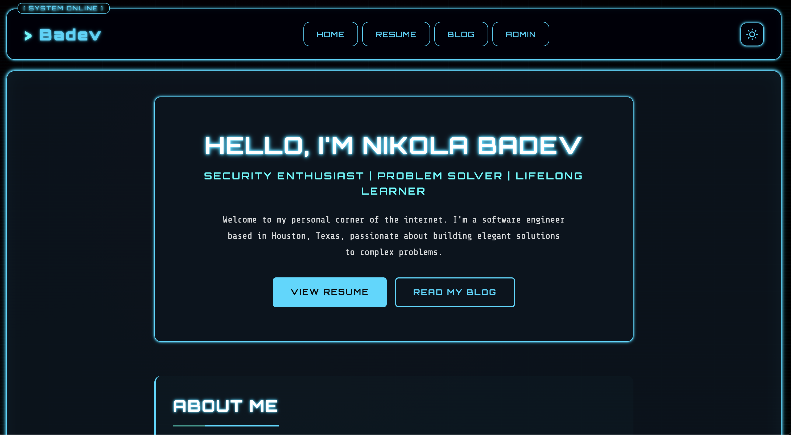

# My 11ty Site

A fast, accessible personal website and blog built with Eleventy (11ty), focused on performance, simplicity, and maintainability.

## 🛠 Tech Stack

| Category    | Tools                 |
| ----------- | --------------------- |
| Generator   | Eleventy (11ty)       |
| CMS         | Decam CMS             |
| Languages   | HTML, CSS, JavaScript |
| Templating  | Nunjucks              |
| Mail Server | Mailcow               |
| Identity    | Github / Netlify      |
| Deployment  | GitHub Pages          |

## 📝 TODO

| Feature / Change                          | Impact                                                 |
| ----------------------------------------- | ------------------------------------------------------ |
| [x] Mobile Version                        | Ensure site is fully working on mobile                 |
| [ ] Contact Form                          | Let users reach me via e-mail                          |
| [ ] Sitemap                               | Improve SEO and indexing                               |
| [ ] Visitor counter                       | Tracks site traffic                                    |
| [ ] Update Resume / Skills                | Highlight skills and professional experience           |
| [ ] Downloadable PDF Resume               | Makes it easy for everyone to view and save my resume  |
| [ ] Decap Admin UX / Workflow / Preview   | Makes content editing more user-friendly and intuitive |
| [ ] Dark/light mode for Admin             | Improves admin panel readability and styling           |
| [ ] Set up newsletter signup with Mailcow | Builds a subscriber base for updates and announcements |
| [ ] RSS Feed                              | Allows users to subscribe to blog updates              |
| [ ] Implement search for blog posts       | Helps visitors find content quickly                    |
| [ ] Implement comment system              | Visitors can engage and share ideas                    |
