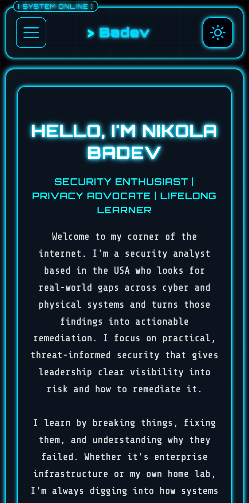

# Badev.net

A fast, accessible personal website and blog built with Eleventy (11ty), focused on performance, simplicity, and maintainability.

| Desktop | Mobile |
|:-------:|:------:|
|  |  |

## Features

- Dark/light theme with system preference detection
- Resume download with email verification to reduce spam
- Contact form protected by Turnstile and 3-layer email validation
- Self-hosted mail server (Mailcow) with private Python relay
- Mobile-first responsive design

## Tech Stack

| Category   | Tools                          |
| ---------- | ------------------------------ |
| Frontend   | Eleventy, Nunjucks, CSS        |
| Backend    | Cloudflare Workers, Python     |
| Storage    | Cloudflare KV                  |
| Email      | Mailcow, SMTP                  |
| Security   | Turnstile, HMAC, MX validation |
| Deployment | GitHub Pages                   |
| CMS        | Decap CMS                      |

## Roadmap

| Status | Feature                   | Description                                            |
| ------ | ------------------------- | ------------------------------------------------------ |
| Done   | Resume / Skills           | Highlight skills and professional experience           |
| Done   | Downloadable PDF Resume   | Makes it easy for everyone to view and save my resume  |
| Done   | Mobile Version            | Ensure site is fully working on mobile                 |
| Done   | Contact Form              | Let users reach me via e-mail                          |
| Done   | Email Verification        | 3-layer validation to block spam and fake emails       |
| Done   | Dark/Light Theme          | Automatic detection with manual toggle                 |
| Done   | Sitemap                   | Improve SEO and indexing                               |
|        | Visitor Counter           | Tracks site traffic                                    |
|        | Decap Admin UX            | Makes content editing more user-friendly and intuitive |
|        | Dark/Light Mode for Admin | Improves admin panel readability and styling           |
|        | Newsletter Signup         | Builds a subscriber base for updates and announcements |
|        | RSS Feed                  | Allows users to subscribe to blog updates              |
|        | Blog Search               | Helps visitors find content quickly                    |
|        | Comment System            | Visitors can engage and share ideas                    |
